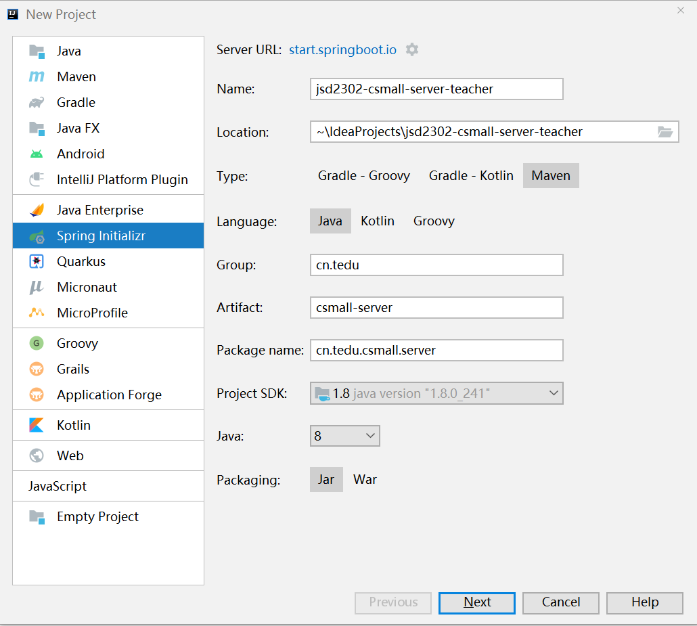
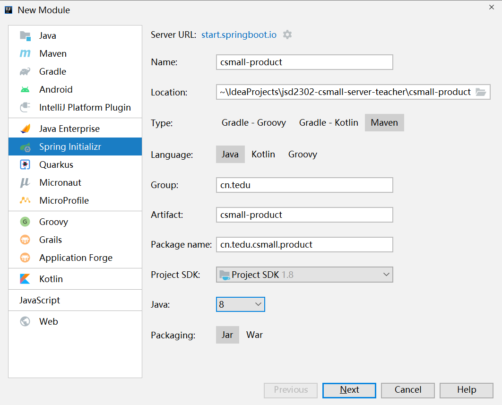

# 第四阶段

项目：酷鲨商城运营管理平台（前端项目 + 后端项目）

老师：成恒

后端项目参考地址：https://gitee.com/chengheng2022/csmall-server-repo.git

前端项目参考地址：https://gitee.com/chengheng2022/csmall-client-repo.git

# 数据库设计

## 商品数据库

数据表设计原则：

- 自动编号的ID应该设计为`bigint`，因为`int`可能不够用，并且，为了便于统一管理，建议所有表的自增ID全部使用`bigint`
- 数值类型的字段使用`unsigned`表示“无符号位的”，以`tinyint`（对应Java中的`byte`类型）为例，如果是有符号位的，取值区间是`[-128, 127]`，如果是无符号位的，取值区间是`[0, 255]`，需要注意，在许多设计中，添加`unsigned`更多的是为了表现“语义”，并不是为了扩容正数的取值上限
- 强烈推荐为每个字段配置`COMMENT`，以表示各字段的含义
- 使用`varchar`时，应该设计一个绝对够用的值，例如“用户名”可以设计为`varchar(50)`，`varchar`是变长的，只会占用实际存入的数据的应占用空间，即使设计得比较大，也不会浪费空间，但是，也不要大到离谱，会影响语义
- 如果你可能需要根据某个字段进行排序，而这个字段可能存在“非ASCII字符”（例如中文），应该添加新的字段，记录对应的数据的拼音，实际排序是，应该根据拼音字段排序，以解决中文的多音字问题

- 许多数据都可能需要注意列表中的数据的顺序，则极可能需要添加“排序序号”字段，以干预排序结果
  - 在编写查询的SQL语句时，只要查询结果可能超过1条，必须显式的指定`ORDER BY`，如果第1排序规则不足以使得所有结果都有明确顺序，还应该继续指定第2排序规则、第3排序规则等

- 当设计有“层级”特征的数据表时，例如设计“类别表”、“省市区数据表”时，可以在表中设计`parent_id`（或类似名称）的字段，使得1张表可以存储若干层级的数据
- 当某些数据的量比较大时，可能需要与别的数据关联起来，在实际应用时，可以起到“筛选”的作用，例如：当发布“笔记本电脑”这种类别的商品时，不需要将“老干妈”这种名牌显示在列表中
- 如果某张表中某个字段的值可能比较大，应该将这个字段设计到另一张表中去，并且，这2张表将形成“1对1”的关系，例如“新闻”数据中的“正文”就是可能比较大的数据，则应该拆分为“新闻信息表”和“新闻正文表”，将新闻的正文数据保存在“新闻正文表”中，而新闻的其它基本信息都保存在“新闻信息表”中即可，这种拆分的目的是为了避免较大的数据影响查询效率
- 对于数据量可能非常大的表，可能后续将会做分库分表的处理，主键ID不要使用自动编号

电商平台的商品设计：

- SPU（Standard Product Unit），标准商品单元，不包含商品的分支型号参数，例如某个手机的SPU数据将不包含手机的颜色、内存容量等，但包含品牌、类别这种各型号都相同的数据
- SKU（Stock Keeping Uint），持久库存单元，是基于SPU基础之上的数据，例如基于某个手机的SPU，在此基础上扩展出手机的颜色、内存容量等，它是真正可售卖的

# 创建项目

本项目是一个聚合项目的结构，首先，创建父级项目，项目参数如下：



在选择Spring Boot版本并勾选依赖项的界面，只需要随便选一个Spring Boot版本即可，依赖项后续会手动添加，至此，父项目创建完成。

当创建完成后，删除此项目的`src`文件夹，并调整`pom.xml`文件，如下：

```xml
<?xml version="1.0" encoding="UTF-8"?>
<project xmlns="http://maven.apache.org/POM/4.0.0" xmlns:xsi="http://www.w3.org/2001/XMLSchema-instance"
         xsi:schemaLocation="http://maven.apache.org/POM/4.0.0 https://maven.apache.org/xsd/maven-4.0.0.xsd">

    <!-- 模块版本，是相对固定的取值 -->
    <modelVersion>4.0.0</modelVersion>
    <packaging>pom</packaging>
    <modules>
        <module>untitled</module>
    </modules>

    <!-- 父级项目，其实，每个基于Spring Boot的项目，都应该是spring-boot-starter-parent的子项目 -->
    <!-- 本次建议使用 2.5.x 系列的版本 -->
    <parent>
        <groupId>org.springframework.boot</groupId>
        <artifactId>spring-boot-starter-parent</artifactId>
        <version>2.5.0</version>
        <relativePath/> <!-- lookup parent from repository -->
    </parent>

    <!-- 当前项目的信息 -->
    <groupId>cn.tedu</groupId>
    <artifactId>csmall-server</artifactId>
    <version>0.0.1</version>

    <!-- 属性配置 -->
    <!-- 可以自定义所需的配置 -->
    <properties>
        <java.version>1.8</java.version>
        <spring-boot.version>2.5.0</spring-boot.version>
    </properties>

    <!-- 依赖管理 -->
    <!-- 配置在此标签下的各依赖，不会被各子项目继承 -->
    <!-- 依赖管理主要是管理各依赖项的版本，各项目添加此处配置的依赖项时不必指定版本号 -->
    <dependencyManagement>
        <dependencies>
            <!-- Spring Boot的基础依赖项 -->
            <dependency>
                <groupId>org.springframework.boot</groupId>
                <artifactId>spring-boot-starter</artifactId>
                <version>${spring-boot.version}</version>
            </dependency>
            <!-- Spring Boot测试的依赖项 -->
            <dependency>
                <groupId>org.springframework.boot</groupId>
                <artifactId>spring-boot-starter-test</artifactId>
                <version>${spring-boot.version}</version>
            </dependency>
        </dependencies>
    </dependencyManagement>

    <!-- 当前项目使用的依赖项 -->
    <!-- 在父项目中配置的依赖项，各子项目均可以直接继承得到，即：子项目不需要添加这些依赖 -->
    <dependencies>
    </dependencies>

</project>
```

完成后，对父级项目点击鼠标右键，选择`New` > `Module`以创建子级项目模块，先创建`csmall-product`，它是用于处理商品数据管理的：




