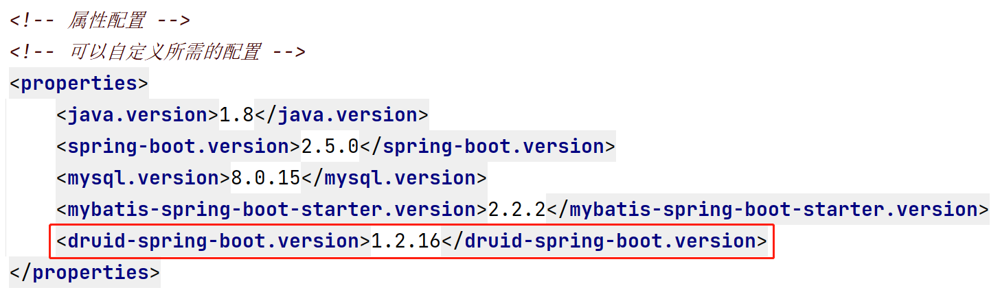
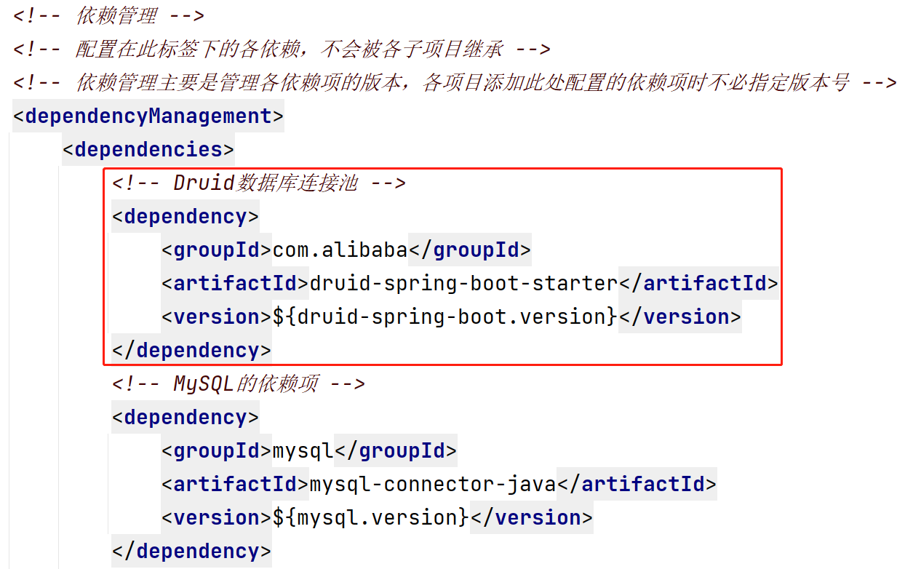
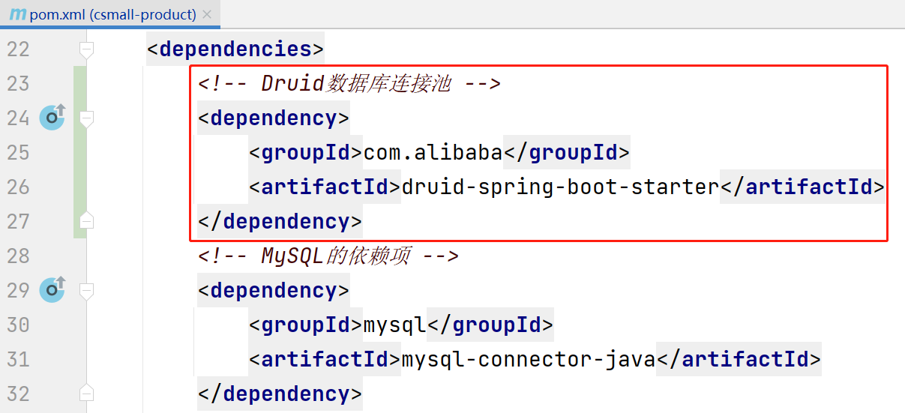
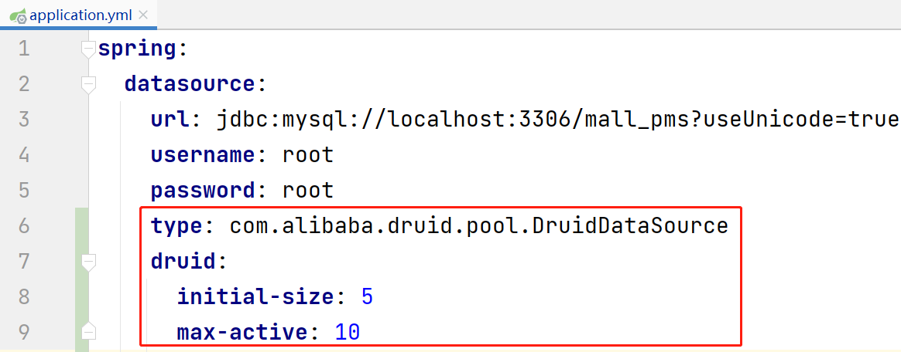
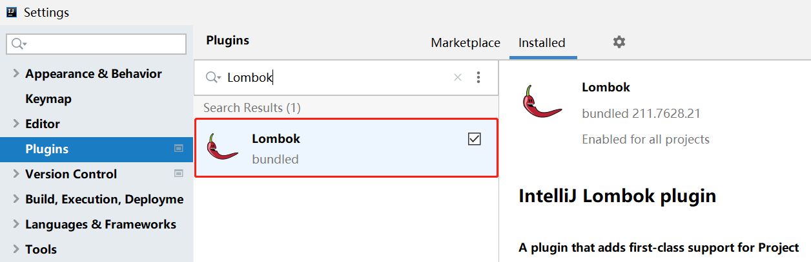
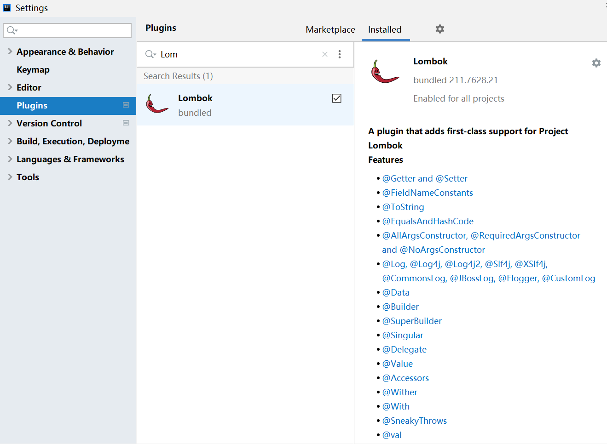

# 关于数据库连接池

数据库连接池的具体表现是`javax.sql.DataSource`类型的对象，它用于管理若干个数据库连接（`Connection`对象），当需要连接到数据库时，从`DataSource`中取出`Connection`对象即可！

`DataSource`是一个接口，有许多第三方的实现，例如：

- `commons-dbcp2`（是早期的`commons-dbcp`的升级款）
- `Hikari`
- `Druid`
- 其它

在绝大部分情况下，Spring Boot项目默认使用的是`Hikari`。

如果要替换为其它数据库连接池，首先，需要添加对应的依赖，然后，在配置文件中显式的指定对应的`DataSource`。

以替换为`Durid`为例，首先，需要添加`druid-spring-boot-starter`依赖项！先在`csmall-server`中添加：





并在`csmall-product`中添加依赖项：



然后，在`application.properties` / `application.yml`中添加配置，以`.properties`文件的配置为例：

```properties
spring.datasource.type=数据库连接池的类的全限定名
```

通常，还会配置：

```properties
spring.datasource.type.druid.initial-size=初始化连接数
spring.datasource.type.druid.max-active=最大激活数
```

以`.yml`文件配置为例：



# 数据库中的数据类型与Java数据类型的对应

| 数据库中的类型                  | Java中的类型    |
| ------------------------------- | --------------- |
| `tinyint` / `smallint` / `int`  | `Integer`       |
| `bigint`                        | `Long`          |
| `char` / `varchar` / `text`系列 | `String`        |
| `datetime`                      | `LocalDateTime` |
| `decimal`                       | `BigDecimal`    |

# POJO的设计规范

所有用于声明属性的类，都应该遵循以下规范：

- 存在无参数构造方法
- 所有属性都是私有权限（`private`）的
- 添加每个属性对应的Setters & Getters
- 添加基于所有属性的`hashCode()`与`equals()`
  - 必须保证：如果2个对象的所有属性值完全相同，则`equals()`对比结果为`true`，否则，返回`false`，如果2个对象的`equals()`为`true`，则这2个对应的`hashCode()`返回相同的值，否则，返回不同的值
  - 通常，所有专门的开发软件生成的这2个方法都符合以上特征
- 实现`Serializable`接口

另外，为了便于观察各属性的值，建议添加`toString()`方法。

# 关于Lombok框架

此框架的依赖项代码：

```xml
<lombok.version>1.18.20</lombok.version>
```

```xml
<!-- Lombok的依赖项，主要用于简化POJO类的编写 -->
<dependency>
    <groupId>org.projectlombok</groupId>
    <artifactId>lombok</artifactId>
    <version>${lombok.version}</version>
</dependency>
```

Lombok的主要作用是：通过特定的注解，在**编译期**生成对应的代码。

例如，在类上添加`@Data`注解，则会生成此类中所有属性对应的Setters & Getters、`hashCode()`、`equals()`、`toString()`方法：

```java
@Data
public class Album implements Serializable {

    private Long id;
    private String name;
    private String description;
    private Integer sort;
    private LocalDateTime gmtCreate;
    private LocalDateTime gmtModified;

}
```

**注意：**使用`@Data`注解时，需要保证当前类的父类存在无参数构造方法。

**注意：**你需要在开发工具中安装Lombok插件：



如果没有安装插件，在编写代码时，开发工具无法给出快捷提示，并且，直接写出相关的代码也会报红，但是，并不影响运行！

由于使用Lombok框架，需要在开发工具中安装对应的插件，所以，并不是所有人都喜欢使用这个框架，甚至有些开发团队会禁止使用这个框架。

关于Lombok的常用注解，可参考安装插件的界面：




