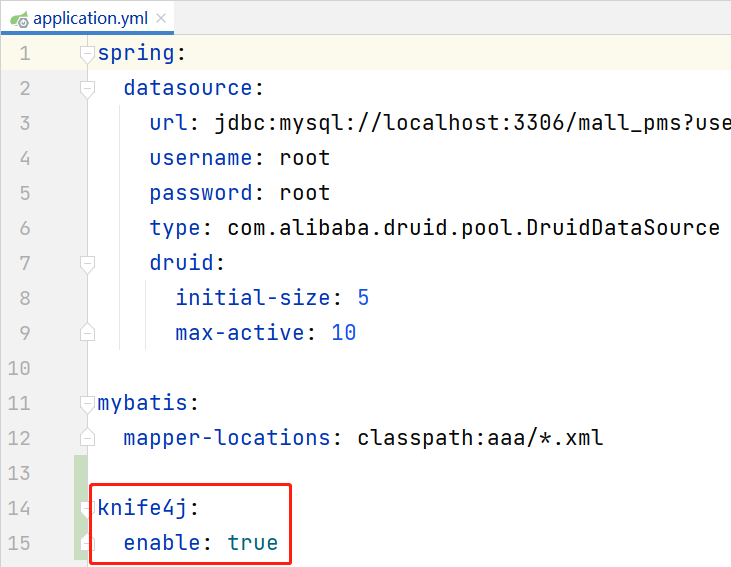
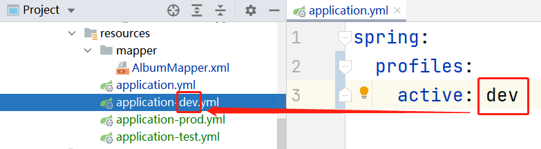

# Knife4j框架

Knife4j框架是一款国人开发的、基于Swagger 2的<u>在线API文档</u>框架。

Knife4j的简单使用只需要3步：

- 添加依赖：`knife4j-spring-boot-starter`，版本`2.0.9`
  - 注意：建议使用Spring Boot 2.5.x版本，如果使用更高版的Spring Boot，Knife4j的版本也需要提高
- 添加配置：在配置文件中添加`knife4j.enable`属性的配置，取值为`true`
- 添加配置类：类的代码相对固定

关于依赖：

```xml
<knife4j-spring-boot.version>2.0.9</knife4j-spring-boot.version>
```

```xml
<!-- Knife4j Spring Boot：在线API文档 -->
<dependency>
    <groupId>com.github.xiaoymin</groupId>
    <artifactId>knife4j-spring-boot-starter</artifactId>
    <version>${knife4j-spring-boot.version}</version>
</dependency>
```

关于配置：在`application.yml`中添加配置：



关于添加配置类，直接复制现有的配置类代码即可，但是，一定要检查配置Controller包的属性值是否与你的项目相符合：

```java
package cn.tedu.csmall.product.config;

import com.github.xiaoymin.knife4j.spring.extension.OpenApiExtensionResolver;
import lombok.extern.slf4j.Slf4j;
import org.springframework.beans.factory.annotation.Autowired;
import org.springframework.context.annotation.Bean;
import org.springframework.context.annotation.Configuration;
import springfox.documentation.builders.ApiInfoBuilder;
import springfox.documentation.builders.PathSelectors;
import springfox.documentation.builders.RequestHandlerSelectors;
import springfox.documentation.service.ApiInfo;
import springfox.documentation.service.Contact;
import springfox.documentation.spi.DocumentationType;
import springfox.documentation.spring.web.plugins.Docket;
import springfox.documentation.swagger2.annotations.EnableSwagger2WebMvc;

/**
 * Knife4j配置类
 *
 * @author java@tedu.cn
 * @version 0.0.1
 */
@Slf4j
@Configuration
@EnableSwagger2WebMvc
public class Knife4jConfiguration {

    /**
     * 【重要】指定Controller包路径
     */
    private String basePackage = "cn.tedu.csmall.product.controller";
    /**
     * 分组名称
     */
    private String groupName = "product";
    /**
     * 主机名
     */
    private String host = "http://java.tedu.cn";
    /**
     * 标题
     */
    private String title = "酷鲨商城在线API文档--商品管理";
    /**
     * 简介
     */
    private String description = "酷鲨商城在线API文档--商品管理";
    /**
     * 服务条款URL
     */
    private String termsOfServiceUrl = "http://www.apache.org/licenses/LICENSE-2.0";
    /**
     * 联系人
     */
    private String contactName = "Java教学研发部";
    /**
     * 联系网址
     */
    private String contactUrl = "http://java.tedu.cn";
    /**
     * 联系邮箱
     */
    private String contactEmail = "java@tedu.cn";
    /**
     * 版本号
     */
    private String version = "1.0.0";

    @Autowired
    private OpenApiExtensionResolver openApiExtensionResolver;

    public Knife4jConfiguration() {
        log.debug("创建配置类对象：Knife4jConfiguration");
    }

    @Bean
    public Docket docket() {
        String groupName = "1.0.0";
        Docket docket = new Docket(DocumentationType.SWAGGER_2)
                .host(host)
                .apiInfo(apiInfo())
                .groupName(groupName)
                .select()
                .apis(RequestHandlerSelectors.basePackage(basePackage))
                .paths(PathSelectors.any())
                .build()
                .extensions(openApiExtensionResolver.buildExtensions(groupName));
        return docket;
    }

    private ApiInfo apiInfo() {
        return new ApiInfoBuilder()
                .title(title)
                .description(description)
                .termsOfServiceUrl(termsOfServiceUrl)
                .contact(new Contact(contactName, contactUrl, contactEmail))
                .version(version)
                .build();
    }
}
```

完成后，可以通过 `/doc.html` 来访问API文档，即在浏览器的地址栏中输入网址：http://localhost:8080/doc.html

# 关于Profile配置文件

在Spring系列框架中，关于配置文件，允许同时存在多个配置文件（例如同时存在`a.yml`、`b.yml`等），并且，你可以按需切换某个配置文件，这些默认不生效、需要被激活才生效的配置，称之为Profile配置。

在Spring Boot项目中，Profile配置的文件名必须是`application-自定义名称.properties`（或使用YAML的扩展名），例如：`application-a.yml`、`application-b.yml`，并且，这类配置文件默认就是没有激活的。

通常，关于“自定义名称”部分的惯用名称有：

- `dev`：表示开发环境
- `test`：表示测试环境
- `prod`：表示生产环境（项目上线）

当然，你也可以根据你所需要的环境或其它特征来处理“自定义名称”部分。

在Spring Boot项目中，`application.properties`（或使用YAML的扩展名）是始终加载的配置文件，当需要激活某个Profiel配置文件时，可以在`application.properties`中配置：

```properties
spring.profiles.active=自定义名称
```

例如：



在开发实践中，需要学会区分哪些配置属性是固定的，哪些是可能调整的，然后，把不会因为环境等因素而发生变化的配置写在`application.properties`中去，把可能调整的配置写在Profile文件中。

例如，在`application.yml`中配置（以下配置中不包含连接数据库的URL、用户名、密码）：

```yaml
spring:
  profiles:
    active: dev
  datasource:
    type: com.alibaba.druid.pool.DruidDataSource
    druid:
      initial-size: 5
      max-active: 10
    
mybatis:
  mapper-locations: classpath:mapper/*.xml
  
knife4j:
  enable: true
```

并且，在其它Profile配置中补充可能调整的配置，例如在`application-dev.yml`中配置：

```yaml
spring:
  datasource:
    url: jdbc:mysql://localhost:3306/mall_pms?useUnicode=true&characterEncoding=utf-8&serverTimezone=Asia/Shanghai
    username: root
    password: root
```

另外，通过`spring.profiles.active`激活配置时，此属性的值可以使用逗号分隔来激活多个配置，例如：

```properties
spring.profiles.active=dev,test
```

如果同时激活的配置中，有相同的属性，但属性值并不同，以偏后的Profile配置文件中的配置值为准，按照以上代码，则以`test`中的配置为准！

另外，所有Profile配置的优先级都高于`application.properties`。

# 关于日志

在开发实践中，应该将数据的关键变化、关联的处理流程记录下来，以便于出现问题时可以辅助排查问题！

注意：在开发实践中，禁止使用`System.out.println()`的做法输出内容（测试代码除外），主要原因有：

- 不易于编写代码
- 执行效率非常低下
- 无论什么情况下都会显示
  - 也许某些输出的数据是敏感的，在开发过程中输出这些数据是为了便于调试，但是，在生产过程中不应该被看到

应该使用日志框架，通过输出日志的方式，来记录相关信息！

在Spring Boot框架的基础依赖项（`spring-boot-starter`）中已经包含日志框架的依赖项， 所以，并不需要专门的去添加日志框架的依赖项，是可以直接使用的！

在添加了Lombok依赖项后，可以在任何类上添加`@Slf4j`注解，则Lombok会在编译期自动在此类中声明名为`log`的变量，通过此变量调用方法即可输出日志。

日志是有**显示级别**的，根据日志内容的重要程度，从可以不关注，到必须关注，依次为：

- `trace`：跟踪信息，例如记录程序执行到了哪个环节，或哪个类、哪个方法等
- `debug`：调试信息，通常输出了一些数据值，用于观察数据的走向、变化过程
- `info`：一般信息，通常不涉及隐私或机密，即使被他人看到也不要紧的
- `warn`：警告信息
- `error`：错误信息

在使用`log`变量输出日志时，可以调用以上5个级别对应的方法，即可输出对应级别的日志！例如调用`log.info()`方法输出的就是`info`级别的日志，调用`log.error()`方法输出的就是`error`级别的日志。

在日志框架中，输出每个级别的方法的参数列表都有相同的版本，例如存在：

```java
void info(String message);
void info(String message, Object... args);
```

就还有：

```java
void trace(String message);
void trace(String message, Object... args);

void debug(String message);
void debug(String message, Object... args);

void warn(String message);
void warn(String message, Object... args);

void error(String message);
void error(String message, Object... args);
```

在普通项目中，默认显示`debug`级别的日志，则`debug`级别及更加重要级别的日志都会显示出来，即`trace`级别不会被显示！

在Spring Boot项目中，默认显示`info`级别的日志！

在Spring Boot项目中，可以通过配置文件中的`logging.level.根包名[.类名]`属性来调整日志的显示级别！

> 提示：以上`logging.level.根包名[.类名]`中的中括号部分是可选的！

例如配置为：

```yaml
logging:
  level:
    cn.tedu.csmall.product: trace
```

则`cn.tedu.csmall.product`包及其子孙包下所有的类中输出的日志的显示级别都将是`trace`！


