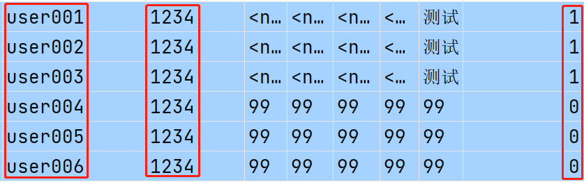
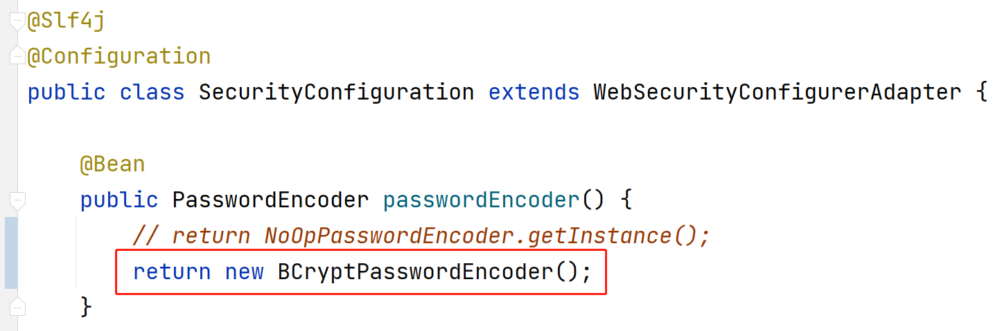
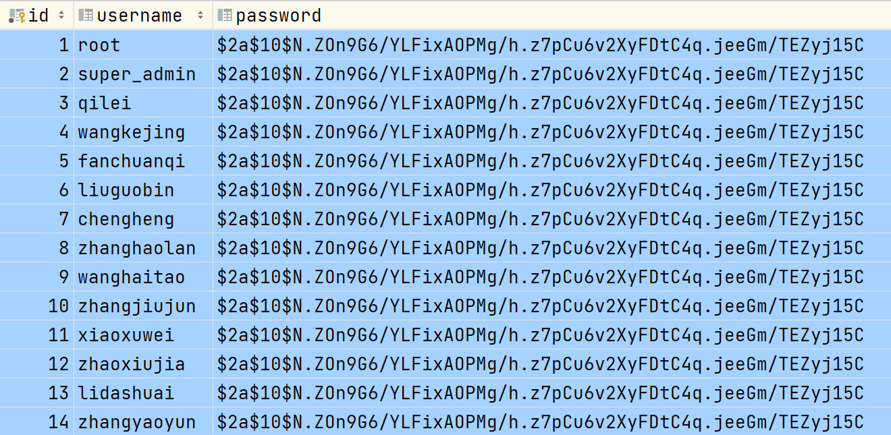

# 基于Spring JDBC框架的事务管理（续）

基于Spring JDBC的事务管理中，默认将根据`RuntimeException`来判断执行过程是否出错，从而回滚，即：

```
开启事务（BEGIN）
try {
	执行业务
	提交（COMMIT）
} catch (RuntimeException e) {
	回滚（ROLLBACK）
}
```

在`@Transactional`注解，还可以配置几个属性，来控制回滚：

- `rollbackFor`：指定根据哪些异常回滚，取值为异常类型的数组，例如：`@Transactional(rollbackFor = {NullPointerException.class, NumberFormatException.class})`
- `rollbackForClassName`：指定根据哪些异常回滚，取值为异常类型的全限定名的字符串数组，例如：`@Transactional(rollbackForClassName = {"java.lang.NullPointerException", "java.lang.NumberFormatException"})`
- `noRollbackFor`：指定对于哪些异常不执行回滚，取值为异常类型的数组
- `noRollbackForClassName`：指定对于哪些异常不执行回滚，取值为异常类型的全限定名的字符串数组

注意：无论怎么配置，`@Transactional`只会对`RuntimeException`或其子孙类异常进行回滚！

**小结：**

- 当某个业务涉及多次“写”操作（例如2次INSERT操作，或1次INSERT操作加1次UPDATE操作，等等）时，必须保证此业务方法是事务性的，理论上，应该按需在业务的抽象方法上添加`@Transactional`注解，在初学时，更建议将此注解添加在接口上
  - 另外，对于同一个业务中的多次查询，使用`@Transactional`使其是事务性的，还可以配置使得此业务的多个查询共用同一个数据库连接，则查询效率可以提升

- 在执行增、删、改这类“写”操作后，应该及时获取“受影响的行数”，并且，判断此值是否符合预期，如果不符合，就应该抛出`RuntimeException`或其子孙类异常，使得事务回滚

# Spring Security框架

## 关于Spring Security框架

Spring Security框架主要解决了认证与授权相关的问题。

认证信息（Authentication）：表示用户的身份信息

认证（Authenticate）：识别用户的身份信息的行为，例如：登录

授权（Authorize）：授予用户权限，使之可以进行某些访问，反之，如果用户没有得到必要的授权，将无法进行访问

## Spring Security框架的依赖项

在Spring Boot中使用Spring Security时需要添加`spring-boot-starter-security`依赖。

## Spring Security框架的典型特征

当添加了`spring-boot-starter-security`依赖后，在启动项目时执行一些自动配置，具体表现有：

- 所有请求（包括根本不存在的）都是必须要登录才允许访问的，如果未登录，会自动跳转到框架自带的登录页面
- 当尝试登录时，如果在打开登录页面后重启过服务器端，则第1次的输入是无效的
  - 具体原因参见后续的`CSRF`相关内容
- 默认的用户名是`user`，密码是在启动项目是控制台提示的一段UUID值，每次启动项目时都不同
  - UUID是通过**128位算法**（运算结果是128个bit）运算得到的，是一个随机数，在同一时空是唯一的，通常使用32个十六进制数来表示，每种平台生成UUID的API和表现可能不同，UUID值的种类有2的128次方个，即：3.4028237e+38，也就是340282366920938463463374607431768211456

- 当登录成功后，会自动跳转到此前尝试访问的URL
- 当登录成功后，可以通过 `/logout` 退出登录
- 默认不接受普通`POST`请求，如果提交`POST`请求，将响应`403（Forbidden）`
  - 具体原因参见后续的`CSRF`相关内容

## 关于Spring Security的配置

在项目的根包下创建`config.SecurityConfiguration`类，作为Spring Security的配置类，此类需要继承自`WebSecurityConfigurerAdapter`，并重写`void configure(HttpSecurity http)`方法，例如：

```java
@Slf4j
@Configuration
public class SecurityConfiguration extends WebSecurityConfigurerAdapter {

    @Override
    protected void configure(HttpSecurity http) throws Exception {
        // super.configure(http); // 不要保留调用父级同名方法的代码，不要保留！不要保留！不要保留！
    }

}
```

# 关于默认的登录页

在自定义的配置类中的`void configure(HttpSecurity http)`方法中，调用参数对象的`formLogin()`方法即可开启默认的登录表单，如果没有调用此方法，则不会应用默认的登录表单，例如：

```java
@Slf4j
@Configuration
public class SecurityConfiguration extends WebSecurityConfigurerAdapter {

    @Override
    protected void configure(HttpSecurity http) throws Exception {
        // super.configure(http); // 不要保留调用父级同名方法的代码，不要保留！不要保留！不要保留！

        // 如果调用以下方法，当Security认为需要通过认证，但实际未通过认证时，就会跳转到登录页面
        // 如果未调用以下方法，将会响应403错误
        http.formLogin();
    }

}
```

## 关于请求的授权访问（访问控制）

在刚刚添加`spring-boot-starter-security`时，所有请求都是**需要**登录后才允许访问的，当添加了自定义的配置类且没有调用父级同名方法后，所有请求都是**不需要**登录就可以访问的！

在配置类中的`void configure(HttpSecurity http)`方法中，调用参数对象的`authorizeRequests()`方法开始配置授权访问：

```java
@Override
protected void configure(HttpSecurity http) throws Exception {
    // 白名单
    // 使用1个星号，可以通配此层级的任何资源，例如：/admin/*，可以匹配：/admin/add-new、/admin/list，但不可以匹配：/admin/password/change
    // 使用2个连续的星可以，可以通配若干层级的资源，例如：/admin/**，可以匹配：/admin/add-new、/admin/password/change
    String[] urls = {
            "/doc.html",
            "/**/*.css",
            "/**/*.js",
            "/swagger-resources",
            "/v2/api-docs",
    };

    // 配置授权访问
    // 注意：以下授权访问的配置，是遵循“第一匹配原则”的，即“以最先匹配到的规则为准”
    // 例如：anyRequest()是匹配任何请求，通常，应该配置在最后，表示“除了以上配置过的以外的所有请求”
    // 所以，在开发实践中，应该将更具体的请求配置在靠前的位置，将更笼统的请求配置在靠后的位置
    http.authorizeRequests() // 开始对请求进行授权
            .mvcMatchers(urls) // 匹配某些请求
            .permitAll() // 许可，即不需要通过认证就可以访问
            .anyRequest() // 任何请求
            .authenticated() // 要求已经完成认证的
    ;
}
```

## 使用自定义的账号登录

在使用Spring Security框架时，可以自定义组件类，实现`UserDetailsService`接口，则Spring Security就会基于此类的对象来处理认证！

则在项目的根包下创建`security.UserDetailsServiceImpl`，在类上添加`@Service`注解，实现`UserDetailsService`接口：

```java
@Slf4j
@Service
public class UserDetailsServiceImpl implements UserDetailsService {
    @Override
    public UserDetails loadUserByUsername(String s) throws UsernameNotFoundException {
        return null;
    }
}
```

在项目中存在`UserDetailsService`接口类型的组件对象时，尝试登录时，Spring Security就会自动使用登录表单中输入的用户名来调用以上方法，并得到方法返回的`UserDetails`类型的结果，此结果中应该包含用户的相关信息，例如密码、账号状态、权限等等，接下来，Spring Security框架会自动判断账号的状态（例如是否启用或禁用）、验证密码（在`UserDetails`中的密码与登录表单中的密码是否匹配）等，从而决定此次是否登录成功！

所以，对于开发者而言，在以上方法中只需要完成“根据用户名返回匹配的用户详情”即可！例如：

```java
@Slf4j
@Service
public class UserDetailsServiceImpl implements UserDetailsService {

    @Override
    public UserDetails loadUserByUsername(String s) throws UsernameNotFoundException {
        log.debug("用户名：{}", s);
        // 假设正确的用户名是root，匹配的密码是1234
        if (!"root".equals(s)) {
            log.debug("此用户名没有匹配的用户数据，将返回null");
            return null;
        }

        log.debug("用户名匹配成功！准备返回此用户名匹配的UserDetails类型的对象");
        UserDetails userDetails = User.builder()
                .username(s)
                .password("1234")
                .disabled(false) // 账号状态是否禁用
                .accountLocked(false) // 账号状态是否锁定
                .accountExpired(false) // 账号状态是否过期
                .credentialsExpired(false) // 账号的凭证是否过期
                .authorities("这是一个临时使用的山寨的权限！！！") // 权限
                .build();
        log.debug("即将向Spring Security返回UserDetails类型的对象：{}", userDetails);
        return userDetails;
    }

}
```

当项目中存在`UserDetailsService`类型的对象后，启动项目时，控制台不会再提示临时使用的UUID密码！并且，`user`账号也不可用！

另外，Spring Security框架认为所有的密码都是必须显式的经过某种算法处理过的，如果使用的密码是明文（原始密码），也必须明确的指出！例如，在Security的配置类中添加配置`NoOpPasswordEncoder`这种密码编码器：

```java
@Bean
public PasswordEncoder passwordEncoder() {
    return NoOpPasswordEncoder.getInstance();
}
```

# 使用数据库中的账号登录

需要将`UserDetailsServiceImpl`中的实现改为“根据用户名查询数据库中的用户信息”！需要执行的SQL语句大致是：

```mysql
select username, password, enable from ams_admin where username=?
```

在`pojo.vo.AdminLoginInfoVO`类：

```java
@Data
@Accessors(chain = true)
public class AdminLoginInfoVO implements Serializable {
    private String username;
    private String password;
    private Integer enable;
}
```

在`AdminMapper`接口中添加抽象方法：

```java
AdminLoginInfoVO getLoginInfoByUsername(String username);
```

在`AdminMapper.xml`中配置SQL：

```xml
<!-- AdminLoginInfoVO getLoginInfoByUsername(String username); -->
<select id="getLoginInfoByUsername" resultType="cn.tedu.csmall.passport.pojo.vo.AdminLoginInfoVO">
    SELECT 
        username, password, enable 
    FROM 
         ams_admin 
    WHERE 
        username=#{username}
</select>
```

在`AdminMapperTests`中编写并执行测试：

```java
@Test
void getStandardById() {
    String username = "root";
    Object queryResult = mapper.getLoginInfoByUsername(username);
    System.out.println("根据【username=" + username + "】查询数据完成，结果：" + queryResult);
}
```

然后，在`UserDetailsServiceImpl`中调整原来的实现，改成：

```java
@Override
public UserDetails loadUserByUsername(String s) throws UsernameNotFoundException {
    log.debug("Spring Security框架自动调用了UserDetailsServiceImpl.loadUserByUsername()方法，用户名：{}", s);
    // 根据用户名从数据库中查询匹配的用户信息
    AdminLoginInfoVO loginInfo = adminMapper.getLoginInfoByUsername(s);
    if (loginInfo == null) {
        log.debug("此用户名没有匹配的用户数据，将返回null");
        return null;
    }

    log.debug("用户名匹配成功！准备返回此用户名匹配的UserDetails类型的对象");
    UserDetails userDetails = User.builder()
            .username(loginInfo.getUsername())
            .password(loginInfo.getPassword())
            .disabled(loginInfo.getEnable() == 0) // 账号状态是否禁用
            .accountLocked(false) // 账号状态是否锁定
            .accountExpired(false) // 账号状态是否过期
            .credentialsExpired(false) // 账号的凭证是否过期
            .authorities("这是一个临时使用的山寨的权限！！！") // 权限
            .build();
    log.debug("即将向Spring Security返回UserDetails类型的对象：{}", userDetails);
    return userDetails;
}
```

为了得到较好的运行效果，你应该在数据表中插入一些新的测试数据，例如：



因为目前配置的密码编码器是`NoOpPasswordEncoder`，所以，本次测试运行时，使用的账号在数据库的密码应该是明文密码！

## 关于密码编码器

Spring Security定义了`PasswordEncoder`接口，可以有多种不同的实现，此接口中的抽象方法主要有：

```java
// 对原密码进行编码，返回编码后的结果（密文）
String encode(String rawPassword);

// 验证密码原文（第1个参数）和密文（第2个参数）是否匹配
boolean matches(String rawPassword, String encodedPassword);
```

常见的对密码进行编码，实现“加密”效果所使用的算法主要有：

- MD（Message Digest）系列：MD2 / MD4 / MD5
- SHA（Secure Hash Algorithm）系列：SHA-1 / SHA-256 / SHA-384 / SHA-512

- BCrypt
- SCrypt

目前，推荐使用的算法是`BCrypt`算法！在Spring Security框架中，也提供了`BCryptPasswordEncoder`类，其基本使用：

```java
public class BCryptTests {

    PasswordEncoder passwordEncoder = new BCryptPasswordEncoder();

    @Test
    void encode() {
        String rawPassword = "123456";
        System.out.println("原文：" + rawPassword);

        for (int i = 0; i < 5; i++) {
            String encodedPassword = passwordEncoder.encode(rawPassword);
            System.out.println("密文：" + encodedPassword);
        }
    }

    // 原文：123456
    // 密文：$2a$10$YOW67gn1jGQsNd1lWFOktuxGEK3Ai4obSCo6m0o0zP3YA4iTm0QoS
    // 密文：$2a$10$AoGlKthb1ZKzTAng5ssX6OUwN8.tC9junqbYhtF0POkr.XdFuoEWy
    // 密文：$2a$10$wgBhSmnoFQ.LdvFCLd8lyOSsHuGVIpVYKW8.bW4yt2kBMYqG1G.5u
    // 密文：$2a$10$OIiWGSjFH02Vr9khLEQnG.s2rGowkotMV14TThAgJK8KQm.WQq6pm
    // 密文：$2a$10$DluGioTO7Zcc0hmwDz8Ld.4Uyp2hIIZ/PcGhFCVd1P3FuSukqJN36
    
    @Test
    void matches() {
        String rawPassword = "123456";
        System.out.println("原文：" + rawPassword);

        String encodedPassword = "$2a$10$wgBhSmnoFQ.LdvFCLd8lyOSsHuGVIpVYKW8.bW4yt2kBMYqG1G.5u";
        System.out.println("密文：" + encodedPassword);

        boolean result = passwordEncoder.matches(rawPassword, encodedPassword);
        System.out.println("匹配结果：" + result);
    }

}
```

关于BCrypt算法，其典型特征有：

- 使用同样的原文，每次得到的密文都不相同
  - BCrypt算法在编码过程中，使用了随机的“盐”（salt）值，所以，每次编码结果都不同
  - 编码结果中保存了这个随机的盐值，所以，并不影响验证是否匹配
- 运算效率极为低下，可以非常有效的避免暴力破解
  - 可以通过构造方法传入`strength`值，增加强度（默认为`10`），表示运算过程中执行2的多少次方的哈希运算
  - 此特征是MD系列和SHA家庭的算法所不具备的特征

另外，SCrypt算法的安全性比BCrypt还要高，但是，执行效率比BCrypt更低，通常，由于BCrypt算法已经能够提供足够的安全强度，所以，目前，使用BCrypt是常见的选择。

## 使用BCrypt算法

只需要在Security配置类中将密码编码器换成`BCryptPasswordEncoder`即可：



接下来，你可以使用数据库中那些密码是密文的账号测试登录（默认的原文都是`123456`）：




```
2023-05-20 17:46:07.014  WARN 36256 --- [nio-9181-exec-2] o.s.s.c.bcrypt.BCryptPasswordEncoder     : Encoded password does not look like BCrypt
```


