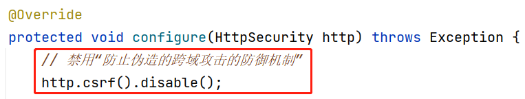
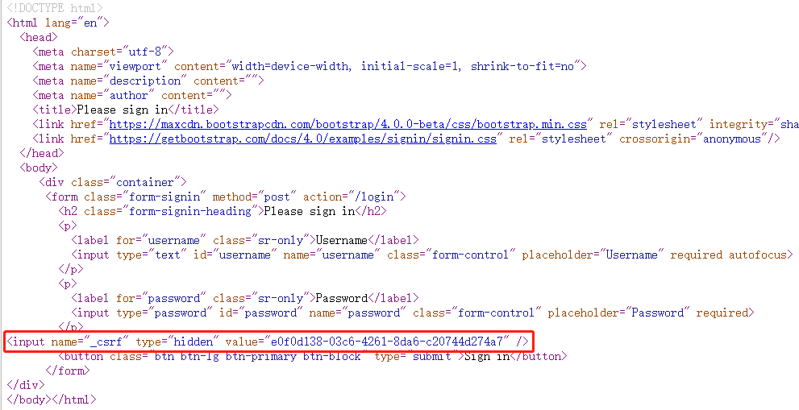
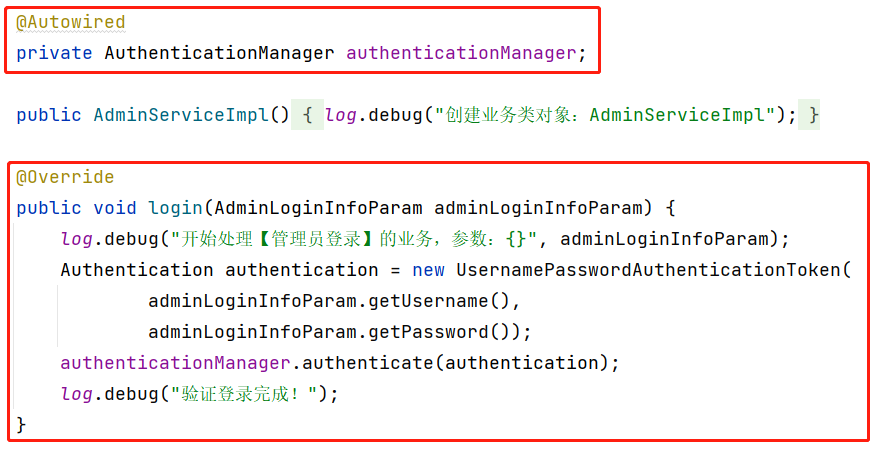
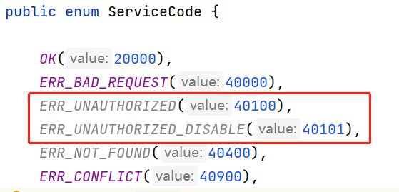
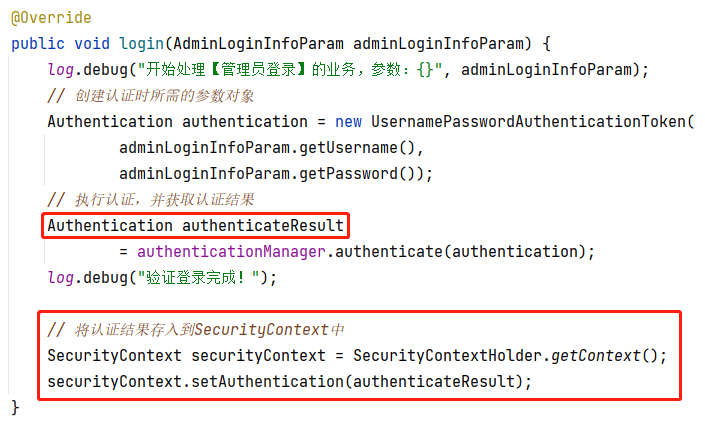
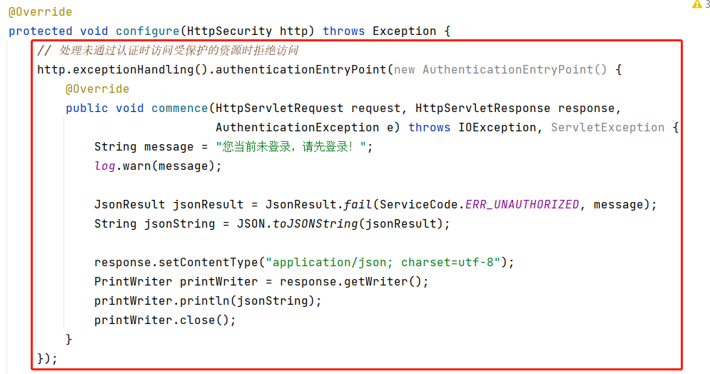
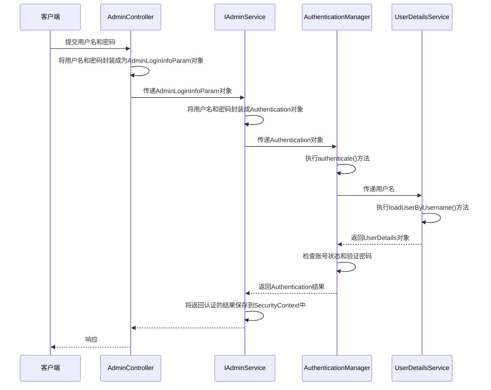
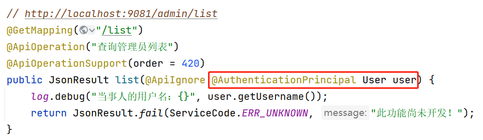
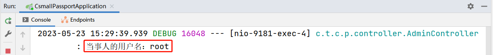

## 关于伪造的跨域攻击

Spring Security框架设计了“防止伪造的跨域攻击”的防御机制，所以，默认情况下，自定义的POST请求是不可用的，简单的解决方案就是在Spring Security的配置类中禁用这个防御机制即可，例如：



**伪造的跨域攻击：**此类攻击原理是利用服务器端对客户端浏览器的“信任”来实现的！目前，主流的浏览器都是**多选项卡**模式的，假设在第1个选项卡中登录了某个网站，在第2个选项卡也打开这个网站的页面，就会被当作是已经登录的状态！基于这种特征，假设在第1个选项卡中登录了某个网上银行，在第2个选项卡中打开了某个坏人的网站（不是网上银行的网站），但是，在这个坏人的网站的页面中隐藏了一个使用网上银行进行转账的请求，这个请求在坏人的网站的页面刚刚打开时就自动发送出去了（自动发送：方法很多，例如将URL设置为某个不显示的``标签的`src`值），由于在第1个选项卡中已经登录了网上银行，从第2个选项卡中发出的请求也会被视为已经登录网上银行的状态，这就实现了一种攻击行为！当然，以上只是举例，真正的银行转账不会这么简单，例如还需要输入密码、手机验证码等等，但是，这种模式的攻击行为是确实存在的，由于使用另一个网站（坏人的网站）偷偷的实现的攻击，所以，称之为“伪造的跨域攻击”！

**典型的防御手段：**在Spring Security框架中，默认就开启了对于“伪造跨域攻击”的防御机制，其做法是在所有POST表单中隐藏一个具有“唯一性”的“随机值”，例如UUID值，当客户端提交请求时，必须提交这个UUID值，如果未提交，则服务器端将其直接视为攻击行为，将拒绝处理此请求！以Spring Security默认的登录表单为例：



提示：此前“如果在打开登录页面后重启过服务器端，则第1次的输入是无效的”，也是因为这种防御机制，当打开登录页，服务器端生成了此次使用的UUID，但重启服务器后，服务器不再识别此前生成的UUID，所以，第1次的输入是无效的！

## 使用前后端分离的登录

Spring Security框架自带了登录页面和退出登录页面，不是前后端分离的，则不可以与自行开发的前端项目中的登录页面进行交互，如果要改为前后端分离的模式，需要：

- 不再启用服务器端Spring Security框架自带的登录页面和退出登录页面
  - 在配置类中不再调用`http.formLogin()`即可
- 使用控制器接收客户端的登录请求
  - 自定义Param类，封装客户端将提交的用户名和密码，在控制器类中添加接收登录请求的方法
  - 注意：需要将此请求配置在“白名单”中
- 使用Service处理登录的业务
  - 在接口中声明抽象方法，并在实现类中重写此方法
  - 具体的验证登录，仍可以由Spring Security框架来完成，**调用`AuthenticationManager`（认证管理器）对象的`authenticate()`方法即可**，则Spring Security框架会自动基于调用方法时传入的用户名来调用`UserDetailsService`接口对象的`loadUserByUsername()`方法，并得到返回的`UserDetails`对象，然后，自动判断账号状态、对比密码等等
    - 可以在Spring Security的配置类中重写`authenticationManagerBean()`方法，并在此方法上添加`@Bean`注解，则可以在任何所需要的位置自动装配`AuthenticationManager`类型的数据，注意：不要使用`authenticationManager()`方法，此方法在某些场景（例如某些测试等）中可能导致死循环，最终内存溢出

关于在Service中实现验证登录：



完成后，重启项目，可以通过API文档的调试功能来测试登录，如果使用无法登录的账号信息，会在服务器端的控制台看到对应的异常：

- 用户名不存在

```
org.springframework.security.authentication.InternalAuthenticationServiceException: UserDetailsService returned null, which is an interface contract violation
```

- 密码错误

```
org.springframework.security.authentication.BadCredentialsException: 用户名或密码错误
```

- 账号被禁用

```
org.springframework.security.authentication.DisabledException: 用户已失效
```

可以在全局异常处理器中添加处理以上异常的方法，通常，在处理时，不会严格区分“用户名不存在”和“密码错误”这2种错误，也就是说，无论是这2种错误中的哪一种，一般提示“用户名或密码错误”即可，以进一步保障账号安全！

关于以上用户名不存在、密码错误时对应的异常，其继承结构是：

```
AuthenticationException
-- BadCredentialsException // 密码错误
-- AuthenticationServiceException
-- -- InternalAuthenticationServiceException // 用户名不存在
```

则可以在处理异常的方法上，在`@ExceptionHandler`注解中指定需要处理的2种异常，并且，使用这2种异常公共的父类作为方法的参数，例如：

```java
// 如果@ExceptionHandler没有配置参数，则以方法参数的异常为准，来处理异常
// 如果@ExceptionHandler配置了参数，则只处理此处配置的异常
@ExceptionHandler({
        InternalAuthenticationServiceException.class,
        BadCredentialsException.class
})
public JsonResult handleAuthenticationException(AuthenticationException e) {
    // 暂不关心方法内部的代码
}
```

在实际处理时，需要先在`ServiceCode`中添加新的枚举值，以表示以上错误的状态码：



然后，在全局异常处理器中添加处理异常的方法：

```java
// 如果@ExceptionHandler没有配置参数，则以方法参数的异常为准，来处理异常
// 如果@ExceptionHandler配置了参数，则只处理此处配置的异常
@ExceptionHandler({
        InternalAuthenticationServiceException.class,
        BadCredentialsException.class
})
public JsonResult handleAuthenticationException(AuthenticationException e) {
    log.warn("程序运行过程中出现了AuthenticationException，将统一处理！");
    log.warn("异常：", e);
    String message = "登录失败，用户名或密码错误！";
    return JsonResult.fail(ServiceCode.ERR_UNAUTHORIZED, message);
}

@ExceptionHandler
public JsonResult handleDisabledException(DisabledException e) {
    log.warn("程序运行过程中出现了DisabledException，将统一处理！");
    log.warn("异常：", e);
    String message = "登录失败，账号已经被禁用！";
    return JsonResult.fail(ServiceCode.ERR_UNAUTHORIZED_DISABLE, message);
}
```

## 关于认证的标准

Spring Security为每个客户端分配了一个`SecurityContext`（可称之为“Security上下文”），并且，会根据在`SecurityContext`中**是否存在认证信息**来判断当前请求是否已经通过认证！即：

- 如果在`SecurityContext`中**存在**有效的认证信息，则视为“**已通过**认证”
- 如果在`SecurityContext`中**没有**有效的认证信息，则视为“**未通过**认证”

所以，在验证登录成功后，需要将认证信息存入到`SecurityContext`中，否则，所开发的登录功能是没有意义的！

使用`SecurityContextHolder`的`getContext()`静态方法可以获取当前客户端对应的`SecurityContext`对象！

具体处理为：



以上认证方法返回的结果例如：

```
UsernamePasswordAuthenticationToken [
	Principal=org.springframework.security.core.userdetails.User [
		Username=root, 
		Password=[PROTECTED], 
		Enabled=true, 
		AccountNonExpired=true, 
		credentialsNonExpired=true, 
		AccountNonLocked=true, 
		Granted Authorities=[这是一个临时使用的山寨的权限！！！]
	], 
	Credentials=[PROTECTED], 
	Authenticated=true, 
	Details=null, 
	Granted Authorities=[这是一个临时使用的山寨的权限！！！]
]
```

其实，以上数据是基于`UserDetailsSerivce`实现类中`loadUserByUsername()`返回的`UserDetails`对象来创建的！

## 未通过认证时拒绝访问

当未通过认证（Spring Security从`SecurityContext`中未找到认证信息）时，尝试访问那些需要授权的资源（不在白名单中的，需要先登录才可以访问的资源），在没有启用`http.formLogin()`时，默认将响应`403`错误！

另外，响应的结果应该都是基于`JsonResult`类型转换得到的JSON格式的字符串，此前，处理请求和处理响应时，都可以由Spring MVC框架自动完成数据格式的转换，此处，Spring MVC框架不会参与处理，则需要人为创建JSON格式的结果！可以借助`fastjson`工具进行处理，这是一款可以实现对象与JSON格式字符串相互转换的工具！需要添加依赖：

```xml
<fastjson.version>1.2.75</fastjson.version>
```

```xml
<!-- fastjson：实现对象与JSON的相互转换 -->
<dependency>
    <groupId>com.alibaba</groupId>
    <artifactId>fastjson</artifactId>
    <version>${fastjson.version}</version>
</dependency>
```

需要在Spring Security的配置类中进行处理：



## 使用前后端分离模式处理登录的数据处理流程

时序图如下：



## 识别当事人（Principal）

当事人：当前提交请求的客户端的身份数据

当通过登录的验证后，`AuthenticationManager`的`authenticate()`方法返回的`Authentication`对象中，就包含了当事人信息！例如：

```
UsernamePasswordAuthenticationToken [
	Principal=org.springframework.security.core.userdetails.User [
		Username=root, 
		Password=[PROTECTED], 
		Enabled=true, 
		AccountNonExpired=true, 
		credentialsNonExpired=true, 
		AccountNonLocked=true, 
		Granted Authorities=[这是一个临时使用的山寨的权限！！！]
	], 
	Credentials=[PROTECTED], 
	Authenticated=true, 
	Details=null, 
	Granted Authorities=[这是一个临时使用的山寨的权限！！！]
]
```

由于已经将以上认证结果存入到`SecurityContext`中，则可以在后续任何需要识别当事人的场景中，获取当事人信息！

Spring Security提供了非常便利的获取当事人的做法，在控制器类中的处理请求的方法的参数列表中，可以声明当事人类型的参数，并在参数上添加`@AuthenticationPrincipal`注解即可，例如：



完成以上代码后，重启项目，可以在API文档中使用各个账号尝试登录并访问以上“查询管理员列表”，可以看到日志中输出了当次登录的账号的用户名，例如：



