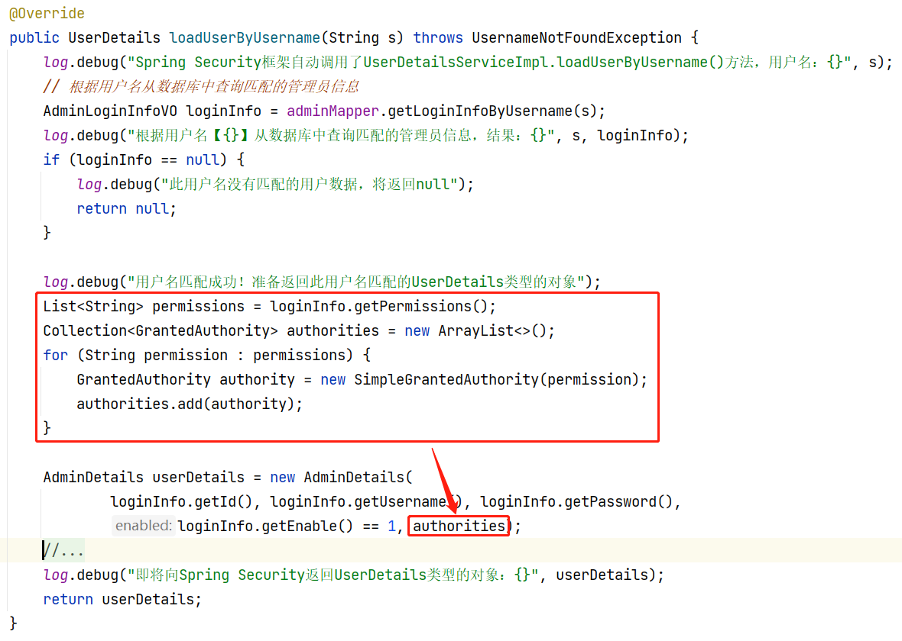
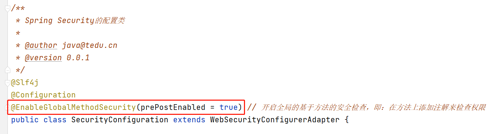
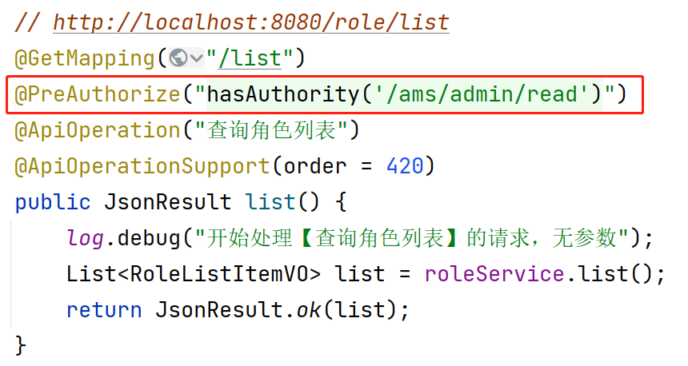
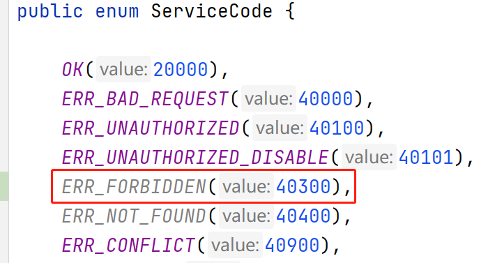
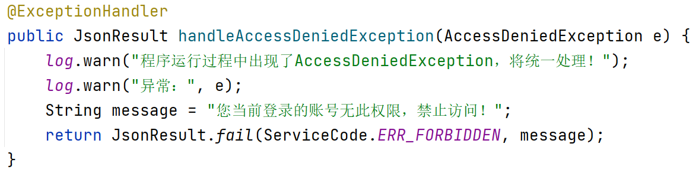

## 基于方法的权限检查

首先，需要保证“在SecurityContext中的认证信息中包含权限列表”，则在`UserDetailsService`实现类对象中：



并且，需要在配置类中开启全局的基于方法的安全检查：



接下来，就可以在任何你认为需要检查权限的方法上通过注解来配置权限，例如：



根据以上配置，如果登录的用户在权限列表中包含 `/ams/admin/read` 这项权限，将允许访问，否则，将不允许访问！

当Spring Security因为“无此权限”而拒绝访问时，会抛出异常：

```
org.springframework.security.access.AccessDeniedException: 不允许访问
```

则在`ServiceCode`中添加新的业务状态码表示“无此权限”：



然后，在全局异常处理器中添加处理以上异常的方法：



提示：以上使用`@PreAuthorize`注解检查权限时，此注解可以添加在任何方法上！例如Controller中的方法，或Service中的方法等等，由于当前项目中，客户端的请求第一时间都是交给了Controller，所以，更适合在Controller方法上检查权限！

## 关于Session

HTTP协议是一种无状态协议，即：当某个客户端向服务器发起请求，服务器端进行处理，后续，此客户端再次发起请求，服务器端并不能直接知道它就是此前来访过的客户端。

从软件技术上，可以使用Session机制来识别客户端的身份，当某个客户端第1次向服务器端发起请求，服务器端会生成一个随机的Session ID（本质上是一个UUID值）并响应给客户端，后续，客户端每次请求时，都会携带这个Session ID来访问服务器端，而服务器端的内存中，使用K-V结构记录每个客户端对应的数据，使用Session ID作为Key，所以，每个客户端在服务器端都有一份属于自己的数据，这个数据就是Session。

由于Session是保存在服务器端的内存中的数据，所以：

- 不适合存储特别大的数据
  - 可以通过开发规范来解决
- 不便于应用到集群或分布式系统
  - 可以通过共享Session的做法缓解此问题
- 不适合长期存储数据
  - 无解

提示：Spring Security的`SecurityContext`默认情况下也是基于Session的。

## 关于Token

Token：票据，令牌

当某个客户端第1次向服务器端发起请求，服务器端会生成Token并响应给客户端，后续，客户端每次请求时，都会携带这个Token来访问服务器端，与Session ID不同，Token本身是有意义的数据，例如，可以包含用户的ID，或用户名等（完全由你来设计），对于服务器端而言，只需要具备“验证并解读Token”的机制即可，并不需要在服务器端保存相关的数据。

由于Token的机制决定了，它天生就适用于集群和分布式系统中，并且，可以非常长时间的保存用户的身份信息！

提示：虽然Token比Session能解决更多的问题，但是，Token的整个使用过程都需要自行编写代码来实现，而Session则简单很多，所以，如果开发特别小型的项目，对存储用户身份信息也没有“长时间”这样的要求，用Session其实更方便。

## 关于JWT

**JWT**：**J**SON **W**eb **T**oken

JWT的官网：https://jwt.io/

每个JWT数据都是由3大部分组成：

- Header（头部）：声明算法与Token类型
- Payload（载荷）：数据
- Verify Signature（验证签名）

可以使用`JJWT`这个工具包来生成、解析JWT，需要在项目中添加依赖项：

```xml
<jjwt.version>0.9.1</jjwt.version>
```

```xml
<!-- JJWT（Java JWT） -->
<dependency>
    <groupId>io.jsonwebtoken</groupId>
    <artifactId>jjwt</artifactId>
    <version>${jjwt.version}</version>
</dependency>
```


