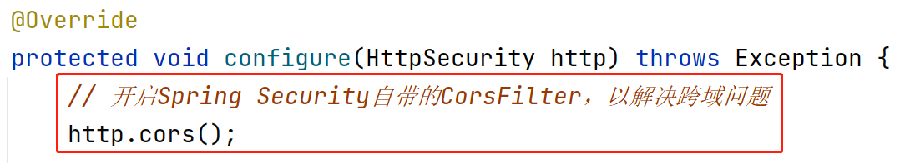

## 处理解析JWT时的异常

由于解析JWT是在过滤器组件中执行的，而过滤器是最早处理请求的组件，此时，控制器（Controller）还没有开始处理这次的请求，则全局异常处理器也无法处理解析JWT时出现的异常（全局异常处理器只能处理控制器抛出的异常）！

首先，在`ServiceCode`中补充新的状态码：

```java
ERR_JWT_EXPIRED(60000),
ERR_JWT_MALFORMED(60100),
ERR_JWT_SIGNATURE(60200),
```

然后，在`JwtAuthorizationFilter`中，使用`try...catch`包裹尝试解析JWT的代码：

```java
// 尝试解析JWT
response.setContentType("application/json; charset=utf-8");
Claims claims = null;
try {
    claims = Jwts.parser().setSigningKey(secretKey).parseClaimsJws(jwt).getBody();
} catch (MalformedJwtException e) {
    String message = "非法访问！";
    log.warn("程序运行过程中出现了MalformedJwtException，将向客户端响应错误信息！");
    log.warn("错误信息：{}", message);
    JsonResult jsonResult = JsonResult.fail(ServiceCode.ERR_JWT_MALFORMED, message);
    String jsonString = JSON.toJSONString(jsonResult);
    PrintWriter printWriter = response.getWriter();
    printWriter.println(jsonString);
    printWriter.close();
    return;
} catch (SignatureException e) {
    String message = "非法访问！";
    log.warn("程序运行过程中出现了SignatureException，将向客户端响应错误信息！");
    log.warn("错误信息：{}", message);
    JsonResult jsonResult = JsonResult.fail(ServiceCode.ERR_JWT_SIGNATURE, message);
    String jsonString = JSON.toJSONString(jsonResult);
    PrintWriter printWriter = response.getWriter();
    printWriter.println(jsonString);
    printWriter.close();
    return;
} catch (ExpiredJwtException e) {
    String message = "您的登录信息已经过期，请重新登录！";
    log.warn("程序运行过程中出现了ExpiredJwtException，将向客户端响应错误信息！");
    log.warn("错误信息：{}", message);
    JsonResult jsonResult = JsonResult.fail(ServiceCode.ERR_JWT_EXPIRED, message);
    String jsonString = JSON.toJSONString(jsonResult);
    PrintWriter printWriter = response.getWriter();
    printWriter.println(jsonString);
    printWriter.close();
    return;
} catch (Throwable e) {
    String message = "服务器忙，请稍后再试！【在开发过程中，如果看到此提示，应该检查服务器端的控制台，分析异常，并在解析JWT的过滤器中补充处理对应异常的代码块】";
    log.warn("程序运行过程中出现了Throwable，将向客户端响应错误信息！");
    log.warn("异常：", e);
    JsonResult jsonResult = JsonResult.fail(ServiceCode.ERR_UNKNOWN, message);
    String jsonString = JSON.toJSONString(jsonResult);
    PrintWriter printWriter = response.getWriter();
    printWriter.println(jsonString);
    printWriter.close();
    return;
}
```

# 处理复杂请求的跨域问题

当客户端提交请求时，在请求头中配置了特定的属性（例如`Authorization`），则这个请求会被视为“复杂请求”。

对于复杂请求，浏览器会先对服务器端发送`OPTIONS`类型的请求，以执行预检（PreFlight），如果预检通过，才会执行本应该发送的请求。

在Spring Security的配置类中，可以在配置对请求授权时，将所有`OPTIONS`类型的请求全部直接许可，例如：


或者，调用参数对象的`cors()`方法也可以，例如：



提示：对于复杂请求的预检，是浏览器的行为，并且，当某个请求通过预检后，浏览器会缓存此结果，后续再次发出此请求时，不会再次执行预检。

# 单点登录

**SSO**（**S**ingle **S**ign **O**n）：单点登录，表示在集群或分布式系统中，客户端只需要在某1个服务器上完成登录的验证，后续，无论访问哪个服务器，都不需要再次重新登录！常见的实现手段主要有：共享Session，使用Token。

目前，如果希望客户端在`csmall-passport`中登录后，在`csmall-product`中也能够被识别身份、权限，需要：

- 复制依赖项：`spring-boot-starter-security`、`jjwt`、`fastjson`
- 复制`LoginPrincipal`
- 复制`ServiceCode`，覆盖此前的文件
- 复制`application-dev.yml`中的自定义的配置
- 复制`JwtAuthorizationFilter`
- 复制`SecurityConfiguration`
  - 删除`PasswordEncoder`的`@Bean`方法
  - 删除`AuthenticationManager`的`@Bean`方法
  - 删除“白名单”中管理员登录的URL地址


```
jhdSfkkjKJ3831HdsDkdfSA9KSIjklJD749Fhsa34fMOdsKf08dfjFhkdfs
```

```
eyJhbGciOiJIUzI1NiIsInR5cCI6IkpXVCJ9.eyJpZCI6NSwiYXV0aG9yaXRpZXNKc29uU3RyaW5nIjoiW3tcImF1dGhvcml0eVwiOlwiL3Btcy9hbGJ1bS9hZGQtbmV3XCJ9LHtcImF1dGhvcml0eVwiOlwiL3Btcy9hbGJ1bS9kZWxldGVcIn0se1wiYXV0aG9yaXR5XCI6XCIvcG1zL2FsYnVtL3JlYWRcIn0se1wiYXV0aG9yaXR5XCI6XCIvcG1zL2FsYnVtL3VwZGF0ZVwifSx7XCJhdXRob3JpdHlcIjpcIi9wbXMvcGljdHVyZS9hZGQtbmV3XCJ9LHtcImF1dGhvcml0eVwiOlwiL3Btcy9waWN0dXJlL2RlbGV0ZVwifSx7XCJhdXRob3JpdHlcIjpcIi9wbXMvcGljdHVyZS9yZWFkXCJ9LHtcImF1dGhvcml0eVwiOlwiL3Btcy9waWN0dXJlL3VwZGF0ZVwifV0iLCJleHAiOjE2ODc1ODcwNTQsInVzZXJuYW1lIjoiZmFuY2h1YW5xaSJ9.AJN1gGhtdmMsnXhWlx0cXSf_VuVS3L4OUgDsbF54vOU
```


