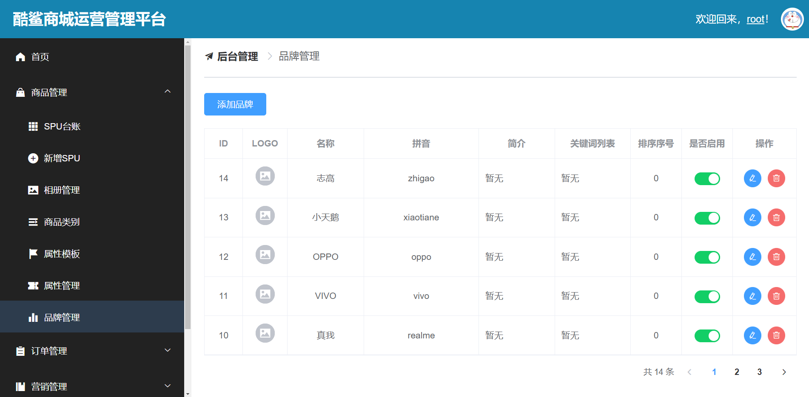

# JSD2302-第四阶段课后作业

## 【第1次】2023-05-11，星期四

在`csmall-product`中，实现以下功能：

- 新增品牌
  - 请求参数包括：name / pinyin / logo / description / keywords / sort / enable
  - 参数规则：name不允许为null，pinyin不允许为null，sort不允许为null，sort必须0~99之间，enable必须0~1之间
  - 业务规则：name值必须唯一，在执行插入之前，将sales / product_count / comment_count / positive_comment_count设置为0，将gmt_create / gmt_modified设置为当前时间再执行插入
- 新增类别
  - 请求参数包括：name / parent_id / keywords / sort / icon / enable / is_display
  - 参数规则：name不允许为null，parent_id必须正数，sort不允许为null，sort必须0~99之间，enable必须0~1之间，is_display必须0~1之间
  - 业务规则：name值必须唯一，在执行插入之前，将gmt_create / gmt_modified设置为当前时间再执行插入

以上功能需完成Mapper、Service、Controller对应的代码，及Mapper、Service的测试，全部完成后，通过API文档进行调试。

作业提交截止时间：明天（05-12）早上09:00

## 【第2次】2023-05-12，星期五

在`csmall-product`中，实现以下功能：

- 根据ID删除相册
  - 请求参数：id，无需封装
  - 参数规则：id必须大于0
  - 业务规则：暂无，但仍是Controller调用Service，Service调用Mapper
  - 其它说明：Mapper层无需专门开发，使用MyBatis Plus提供的删除功能即可；Service层实现时，直接调用Mapper方法实现删除；Controller层调用Service实现删除，需配置API文档的各显示文本
- 根据ID删除属性模板
  - 参考“根据ID删除相册”
- 根据ID删除品牌
  - 参考“根据ID删除相册”
- 根据ID删除类别
  - 参考“根据ID删除相册”
- 修改相册详情
  - 请求参数：id，AlbumUpdateInfoParam（包含name / description / sort）
  - 参数规则：id必须大于0，其它参数规则参考添加时的规则
  - 业务规则：暂无
  - 其它说明：可参考老师的代码
- 修改属性模板详情
  - 请求参数：id，AttributeTemplateUpdateInfoParam（包含name / pinyin / keywords / sort）
  - 其它参考“修改相册详情”
- 修改品牌详情
  - 请求参数：id，BrandUpdateInfoParam（包含name / pinyin / logo / description keywords / sort）
  - 其它参考“修改相册详情”
- 修改类别详情
  - 请求参数：id，CategoryUpdateInfoParam（包含name / keywords / sort / icon）
  - 其它参考“修改相册详情”

以上功能需完成Mapper、Service、Controller对应的代码，及Mapper、Service的测试，全部完成后，通过API文档进行调试。

作业提交截止时间：下周一（05-15）早上09:00

## 【第3次】2023-05-17，星期三

在`csmall-product`中，完善以下功能：

- 根据ID删除属性模板
  - 业务规则：数据不存在时，不允许删除；存在关联数据时，不允许删除

- 根据ID删除品牌
  - 业务规则：数据不存在时，不允许删除；存在关联数据时，不允许删除
- 根据ID删除类别
  - 业务规则：数据不存在时，不允许删除；存在关联数据时，不允许删除

以上功能需完成Mapper、Service、Controller对应的代码，及Mapper、Service的测试，全部完成后，通过API文档进行调试。

作业提交截止时间：明天（05-18）早上09:00

## 【第4次】2023-05-18，星期四

在`csmall-product`和`csmall-client`中，完成以下功能的完整代码：

- 显示“属性模板”列表
- 删除“属性模板”
- 修改“属性模板”

作业提交截止时间：明天（05-19）早上09:00

## 【第6次】2023-05-20，星期六

在`csmall-product`和`csmall-client`中，完成以下功能的完整代码：

- 显示“品牌”列表

  - 显示效果可参考：

    

- 删除“品牌”

  - 业务规则：存在关联数据时不允许删除

- 修改“品牌”

  - 业务规则：新名称不允许与其它数据原有名称冲突
  - 允许修改的数据有：LOGO、名称、拼音、简介、关键词列表、排序序号


作业提交截止时间：下周一（05-22）早上09:00

# 【第7次】2023-05-25，星期四

附：本周一（5月22日）已经布置的内容：

```
1. 查询管理员列表，在Service层实现分页
2. 根据ID删除管理员，在Service层需同步删除对应的“管理员与角色的关联”数据
3. 补全添加管理员的业务：在Service层自动装配PasswordEncoder，插入管理员数据之前，取出原密码，执行加密，将密文存入到Amin对象再插入
4. 根据ID修改管理员密码，此功能用于最高权限的管理员修改其他账号密码，在Service层无需验证原密码，直接写入新密码对应的密文即可，但需要验证账号是否存在
5. 修改管理员的基本信息，此功能用于最高权限的管理员修改其他账号信息，需验证账号是否存在、新手机号码和新邮箱不可以与其他账号的冲突
```

在`csmall-passport`项目中，完成以上功能对应的Controller层代码。

在`csmall-client`项目中实现：

- 显示管理员列表
- 删除管理员
- 修改管理员的基本信息

作业提交截止时间：明天（05-26）早上09:00


